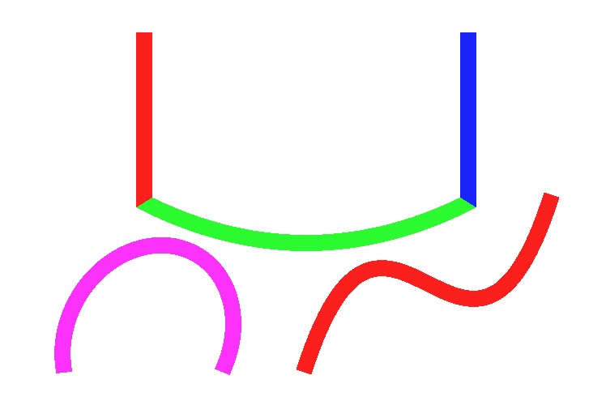

# WebGL-Path2D

用WebGL Shader的方式实现Path2D。

## Roadmap

* [x] 独立的图形绘制
    * [x] 直线
    * [x] 弧线
    * [x] 二次曲线
    * [x] 三次曲线
* [ ] lineCap/lineJoin
    * [x] lineCap
    * [x] lineJoin
    * [ ] 细节处理
* [ ] anti-alias
    * [ ] resolution
    * [ ] smoothstep
* [ ] 数据准备
    * [ ] prevPos/nextPos计算
* [ ] parser
    * [ ] 参数解析
    * [ ] z 闭合命令

## 说明

目前没有实现parser，只有数据到图形的映射。

每个path segment用如下信息控制：
* `vec2 startPos`: 起始点位置
* `vec2 endPos`: 终点位置
* `vec2 prevPos`: 上一个点位置（用于计算交接处形状，如果是端点，设为0）
* `vec2 nextPos`: 下一个点位置（用于计算交接处形状，如果是端点，设为0）
* `float type`: 曲线类型
    * `0`: line
    * `1`: quadratic curve
    * `2`: arc
    * `3`: cubic curve
* `vec4 cp`: 曲线控制点
    * line: `[0, 0, 0, 0]`
    * quadratic curve: `[x, y, 0, 0]` 控制点坐标为(x, y)
    * arc: `[rx, ry, phi, flags]` 弧线的参数
        * `rx, ry`: 椭圆的两个半径
        * `phi`: 椭圆与x轴夹角
        * `flags`: 用2-bit存储，高位是fa，低位是fs，和svg path方案相同
    * quadratic curve: `[x1, y1, x2, y2]` 两个控制点的坐标
* `vec4 color`: 颜色 (r, g, b, a)，范围 0-1

详细参照example里的代码

lineCap, lineJoin, lineWidth 暂时没有暴露接口，有需要在renderer里边改

